# Curso en linea de kotlin 

LLVM es un copilador que permite copilar varios lenguajes de programacion. Kotlin corre en la JVM(java virtual machine). 

1. Kotlin previene el NullPointerException
2. Es de codigo abierto
3. kotlin y java copilan a bitcode
4. Tiene interpolaridad con java
5. Dato : las variables inmutables son las constantes o ***val**

Tipado estatico:es la máquina virtual la que infiere el tipo a las variables y, por tanto, no hay necesidad de especificarlas.

---
---

# Kotlin en android 

### Estructura del proyecto. 
src: en esta carpeta se encuentra el codigo fuente.

res: en esta carpeta se encuentran todos los recursos que no son codigo, como imagenes,themes,colors,etc.

Andriod Manifest: aqui declaramos todos los permisos, themes, etc. Aqui esta la configuracion de la app.

### Conexion entre kotlin y xml

Xml: es lo que se ve o la interfaz grafica. Los archivos xml se encuentran dentro de la carpeta res 

Kotlin: es para darle funcionamiento. El codigo de toda nuestra aplicacion se va a encontrar dentro de la carpeta java.

Para poder hacer una conexion entre el codigo y los archivos xml debemos asignarle un id a la View que queremos vincular 

```xml
 <TextView
        android:id="@+id/tvHola"
        android:layout_width="wrap_content"
        android:layout_height="wrap_content"
        android:text="Hello World!"
        app:layout_constraintBottom_toBottomOf="parent"
        app:layout_constraintEnd_toEndOf="parent"
        app:layout_constraintStart_toStartOf="parent"
        app:layout_constraintTop_toTopOf="parent" />

```
Una vez vinculada vamoas a tener que crear una constante donde buscaremos la View que queremos 

```kotlin
val tvTexto = findViewById<TextView>(R.id.tvHola)
```
Y para poder modificar el texto de este TextView colocamos lo siguiente: 

```kotlin
   tvTexto.text = "Hola"
```


### TextView

Un textView es una vista que va a mostrar texto el cual no puede ser modificado por el usario, solo por el programador. Se le pueden asignar valores que esten  en el xml de strings para que diga algo(el archivo string esta en res y este te permite tener texto guardado para no repetirlo)  

### Layouts 

Un layout es una plantlla nos permite acomodar vistas como nosotros queramos. Uno de los layouts mas basicos es el LinearLayout.

Los LinearLayout funcionan de forma lineal acomodando las vistas una detras de la otra dependiendo de la acomodacion que le hayos puesto(horizontal o vertical). En este tipo de layout, nosotros podemos agragar un peso a cada vista que este dentro de este, un peso es el espacion que queremos que ocupe una vista.

Por defecto cuando ponemos un LinearLayour la orientacion nos la da por defecto como horizontal, para poder cambiarla necesitamos porner orintacion="verical". Tambien se pueden agregar linearLayout dentro de linearLayout, para poder acomodar las vistas de diferentes formas.

Ejemplo de LinearLayout:

```xml
<?xml version="1.0" encoding="utf-8"?>
<LinearLayout xmlns:android="http://schemas.android.com/apk/res/android"
    xmlns:app="http://schemas.android.com/apk/res-auto"
    xmlns:tools="http://schemas.android.com/tools"
    android:layout_width="match_parent"
    android:layout_height="match_parent"
    tools:context=".MainActivity"
    android:orientation="vertical">
  <TextView
        android:id="@+id/etTextBueno"
        android:textSize="28sp"
        android:text="@string/hola"
        android:layout_width="match_parent"
        android:layout_height="wrap_content"
        android:layout_weight="1"/>
    <Button
        android:layout_width="match_parent"
        android:layout_height="wrap_content"
        android:layout_weight="1"/>
    <TextView
        android:textSize="28sp"
        android:text="@string/hola"
        android:layout_width="match_parent"
        android:layout_height="wrap_content"
        android:layout_weight="1"/>
</LinearLayout>
```

### Width y height 

Estas propiedades marcan el alto y ancho de una vista y todas estas vsitas tienes un width y un height.

Hay tres formas de asignarle un ancho y alto:

1. Medidas con numeros: en este tipo de medidas se le asignan numeros como medidad de la siguiente forma:
```kotlin
android:layout_width="20dp"
android:layout_height="20dp"
```
2. Match_parent: Lo que hace es asignarle todo el tamaño que contenga su contenedor padre:
```kotlin
android:layout_width="match_parent"
android:layout_height="match_parent"
```
3. Wrap_content: lo que hace es asignarle el tamaño dependiendo de su contenido:
```kotlin
android:layout_width="wrap_content"
android:layout_height="wrap_content"
```

### Variables y constantes en kotlin 

Una variable es un espacio en memoria para poder guardar valores los cuales pueden cambiar y una constante es lo mismo pero su valor no puede cambiar. Para crear una variable en kotlin utilizamos la palabra reservada **var** y para crear una constante utilizamos **val**, para definir que tipo de dato es la variable o constante, debemos poner :TipoDeDato.


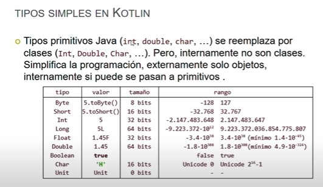


Como se utilizan los strings 


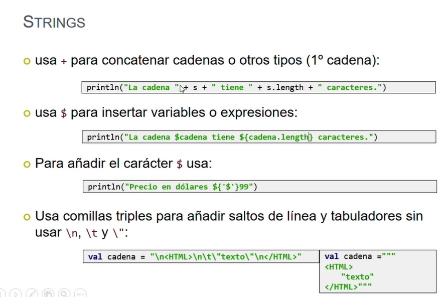


Ejemplo de como declarar variables o constantes: 

```kotlin 
var a:Int = 12
val message:Strin = "Hello,Kotlin!"
```

### Metodos de conversion de variables

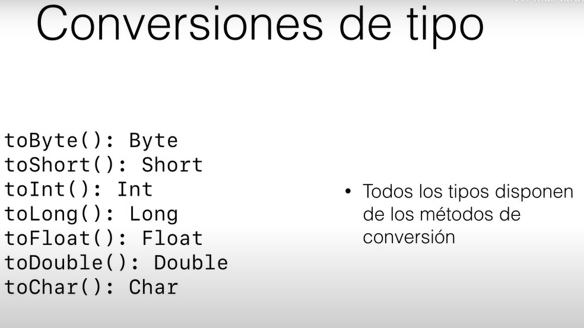


### Operadores aritmeticos


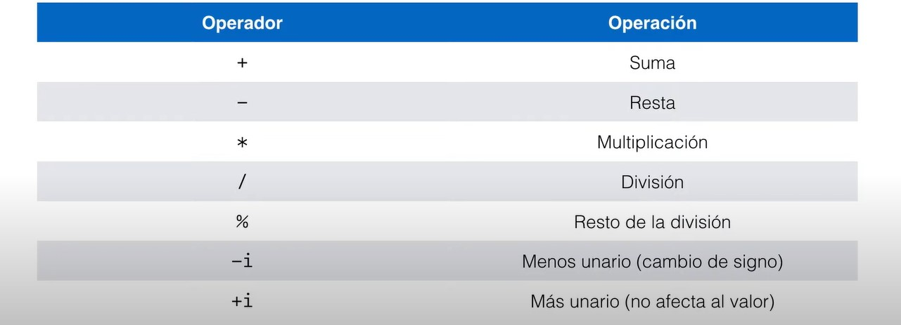


### Entrada por consola 

Para mostrar un mensaje se debe ocupar: 

```kotlin 
println("HOLA")
```
Para recibir valores por consola, debemos utlizar la funcion readLine() esta funcion solo va a aceptar valores Strings y tambien podremos guardar dicho dato recibido por consola en una variable. Ejemplo:

```kotlin
println("Dime tu nombre")

var name = readLine()

println("Hola $name")

```

ReadLine cuando recibe el valor por consola, este valor es un String y se puede cambiar por si quieres hacer alguna operacion o ocupar tipos de datos numericos. Ejemplo:

```kotlin
println("Introduce el numero")

var number = readLine()?.toInt()

printnl(number?.plus(12)?: "Es nulo")
```

### Variables anulables o Evitar nullPointerException

Se pueden declarar varibles que pueden recibir  valores nulos en kotlin, de la siguiente forma agregando ?  despues de definir su tipo de dato:

```kotlin
val nombre:String? = "Enrique"
```

Se puede acceder a este tipo de varibles anulables  de la siguiente forma y se debe de hacer porque si no, no te va dejar utlizar la variable: 

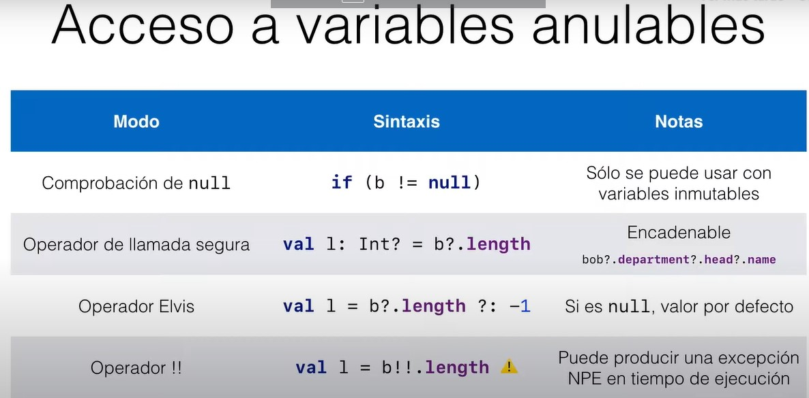

Hay tambien otra forma de verificar si son nulas las variables de una forma mas sencilla y seria utilizando ? 

```kotlin
var name:String? = null 
name?.toUpperCase()
```

Lo que hace esto es comprobar si la variables es nula antes de hacer cualquier cosa.


El operador elvis funciona de la siguiente manera 

```kotlin
val text:String?

text = null 

println(text?.length?:"NADA")
```
Primero creamos una varible o constante la cual va a poder se nula(poniendo ?), va a funcionar de la misma forma que el anterior pero regresando un valor por defecto en el caso de que sea null y en el ejemplo imprimiria **Nada**(en caso de que sea null)

### Formas de conversion de datos 

Hay 3 versiones para convertir las variables a otro tipo de dato 

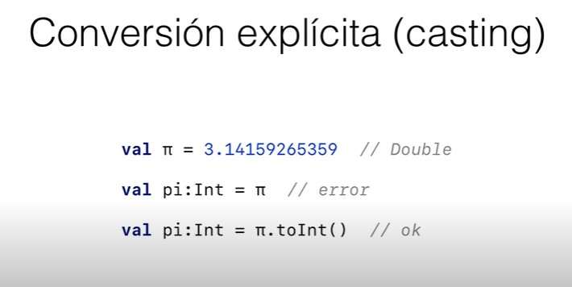

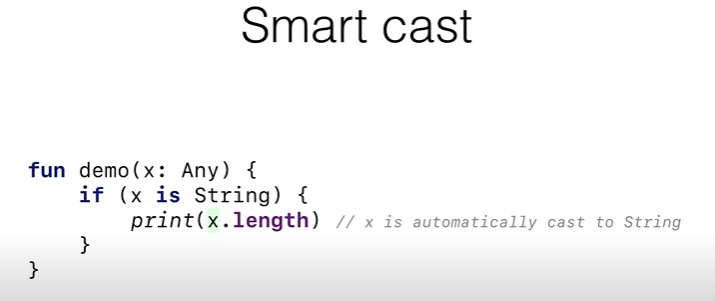

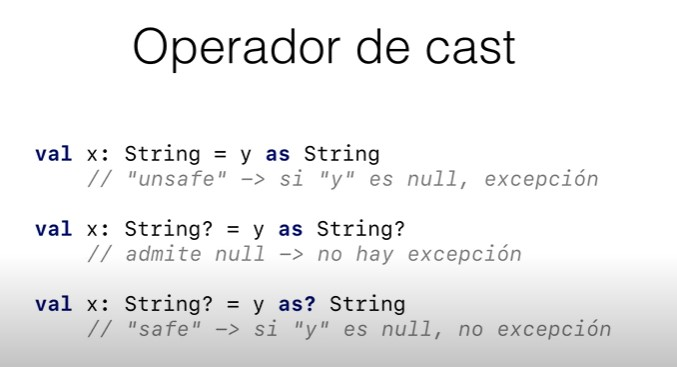


### Propiedades lateinit and lazy    

Estas propiedades se utilizan para inicializar de forma tardia las variables pero es mas recomendable siempre inicializarlas una vez creada la variable


Inicializacion nullable, esta es cuando ocupamos el ? en el tipo de dato 

```kotlin
val texto :String?

texto = null
```

Lateinit solo puede utilizarse en :

1. Con variables mutables(var)
2. Declarada en el cuerpo de una clase(no en el constructor primario)
3. No tiene un getter o setter personalizado 
4. Que sea nullable E

Ejemplo:

```kotlin
lateinit var texto:String
```

Lazy solo se puede utilizar con:

1. Una variable inmutable(val)
2. Declarada en el cuerpo de una clase(no en el constructor primario)
3. No tiene getter personalizado 

Ejemplo: 

```kotlin
val text:String by lazy{"Un valor"}
```

Lazy tiene un valor por defecto que es **Un valor** en el caso del ejemplo que solo va a ser accedido si se cumplen  ciertos requerimientos


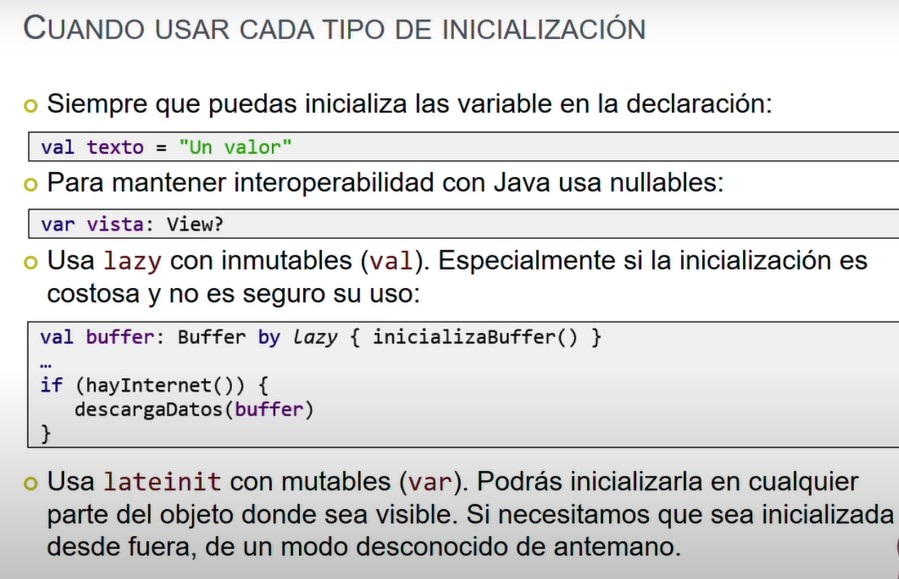


### Operador Let 

El operador let es útil para simplificar la validación de objetos nulos y para ejecutar código en un objeto sin tener que repetir su nombre varias veces en el bloque. Además, también es posible encadenar varios operadores let para realizar múltiples operaciones en el mismo objeto, lo que puede resultar en un código más legible y conciso.

Tambien se utiliza para crear una copia de un variable que puede ser nula para poder acceder a ella desde un metodo el cual no cuente con la variable 

```kotlin
var propiedad: Int? = 42 

fun unMetdo(){
    propiedad?.let{
        println(it)
    }
}
```

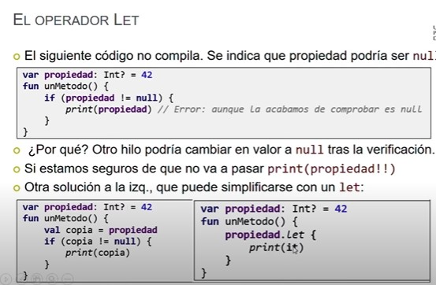

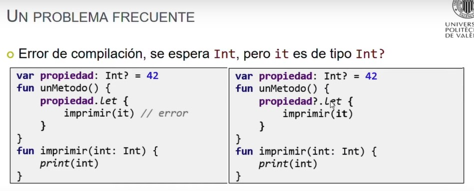


### Estructuras de control 

En kotlin no es necesario utilizar el ; al final de cada cosa. En el caso de los ifs, se nos permite poder guardar estos en un expresion mejor dicho poder guardarlo en una variable

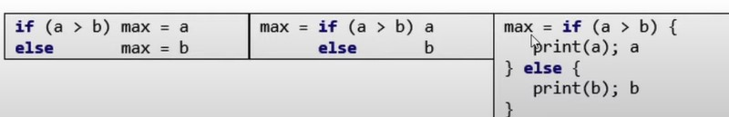

Tambien se introdujo la sentencia **When** que es lo mismo que el switch pero es mas legible y permite el uso de expresiones.

```kotlin
val number = 4 

when(number){

    1 -> println("Uno")
    2 -> println("Dos")
    3 -> println("Tres")
    4 -> println("Cuatro")
    5 -> println("Cinco")
}
```
##### Expresion con When

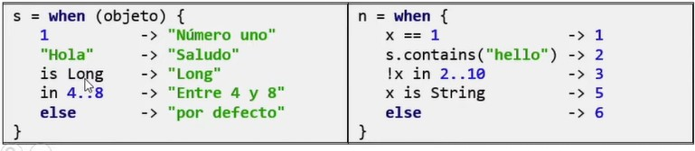


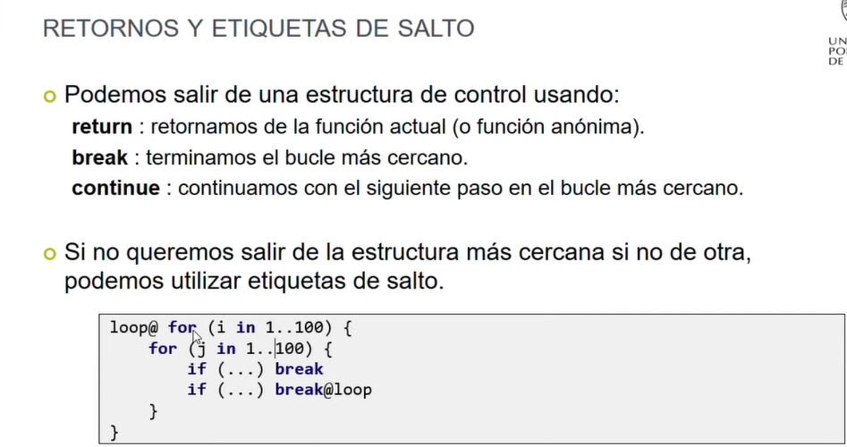

### Operadores  para usar en estructuras de control 

* Desigualdad e Igualdad: == !=
* Mayor que:  >
* Menor que: < 
* Mayor igual: >=
* Menor igual : <= 
* And: &&
* Or: ||
* Negaciono Not: !

### Indagacion mayor en la sentecia When 

Funciona como si fuera un switch,pero tiene un mejor funcionamiento y en vez de utilizar el default se utiiliza un else 

```kotlin
when(variable){
    valor1 -> sentencia1
    valor2 -> sentencia2
    valor3 ->{
      sentecia3
      sentencia4  
    } 
    else -> sentencia5


}
```

En un When se puede analizar casos multiples


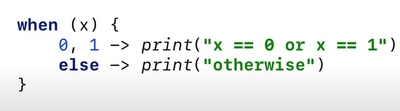

Analiza evaluaciones de expresiones arbitrarias

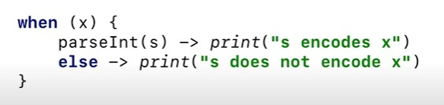

Tambien podemos evaluar rangos utilizando **In**

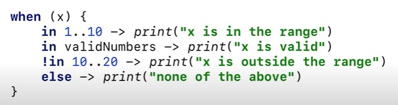


## Ejercicio calculadora 

En este ejercicio aprendi acerca de los metodos **plus,minus,times,div**, estos metodos se encargan de sumar, restar, multiplicar y dividir. Este metodo acepta argumentos con valores nullos utilizando los operadores de llamada segura como **?.** o el **operador elvis** y tambien utlize el operador let para duplicar una variable(number1) y dentro hice las operaciones de la calculadora. Utilize let por que en kotlin te lo indica, ya que la variable  pueda cambiar su valor despues de ser comprobada y no correria el codigo, asi que ocupamos let para ejecutar la varible en contexto de objeto y que adentro de los lamdas se haga el bloque de codigo solicitado 

Codigo del ejercicio: 

```kotlin

fun main() {
    calculadora()
    repit()
}

fun calculadora() {
    println("Operacion a realizar 1.Suma, 2.Resta, 3.Multiplicacion. 4.Division")
    val operacion = readLine()
    when (operacion) {
        "1" -> {
            println("Introduce el numero 1")
            val number1 = readLine()?.toFloat()

            println("Introduce el numero 2")
            val number2 = readLine()?.toFloat()

            println(
                number1?.let {
                    number2?.plus(it)
                }
            )
        }
        "2" -> {
            println("Introduce el numero 1")
            val number1 = readLine()?.toFloat()
            println("Introduce el numero 2")
            val number2 = readLine()?.toFloat()

            println(
                number1?.let {
                    number2?.minus(it)
                }
            )
        }
        "3" -> {
            println("Introduce el numero 1")
            val number1 = readLine()?.toFloat()
            println("Introduce el numero 2")
            val number2 = readLine()?.toFloat()
            println(
                number1?.let {
                    number2?.times(it)
                }
            )
        }
        "4" -> {
            println("Introduce el numero 1")
            val number1 = readLine()?.toFloat()
            println("Introduce el numero 1")
            val number2 = readLine()?.toFloat()

            println(
                number1?.let {
                    number2?.div(it)
                }
            )
        }
        else -> {
            println("Opcion no valida")
        }
    }
}

fun repit() {
    println("Quieres hacer otra operacion y/n")
    val response = readLine()
    while (response == "y" || response == "Y") {
        when (response) {
            "y", "Y" -> {
                calculadora()
            }
            "n", "N" -> println("Adios")
            else -> {
                repit()
            }
        }
    }
}
```

#### Operaciones con rangos

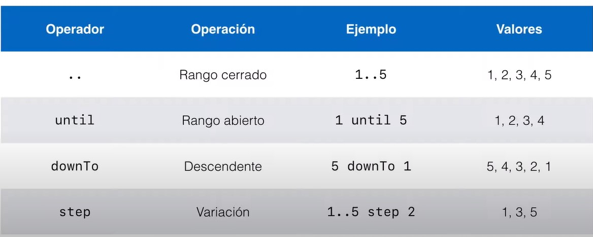

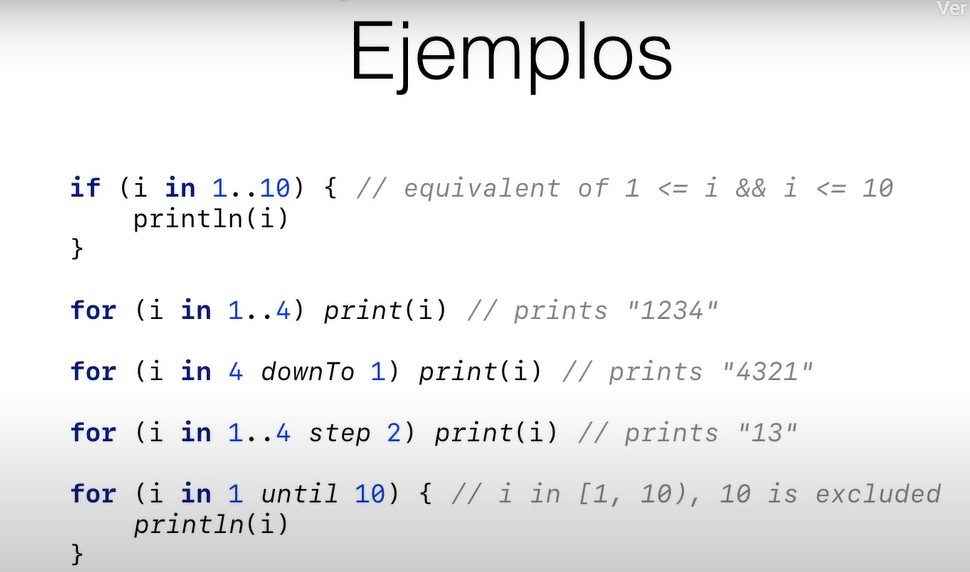

#### Ciclo When 
Un ciclo es un estructura de control que se repite un numero determinado de veces. Existen tres tipos:

1. While 
```kotlin
var number = 0
while(number < 5 ){
    println("Hola")
    number++ //El ++ va a ser necesario si tu bucle lo necesita osea no es tan necesario
} 

```
2. DoWhile: La diferencia que tiene con el while es que no evalua la condicion en una primera ocasion, haciendo asi que se repita una vez y ya despues se haga la evaluacion para que se repita nuevamente 

```kotlin
var number = 0
do{
    println("HOla do while")// Se va imprimir al menos una vez aunque la condicion de abajo sea falsa 
    number++
}while(number < 5)

```

3. For y Foreach: El for va a servir para arreglos,maps o colecciones de datos para cuando que hacer algo con los datos que estas a dentro de una coleccion, el forEach tiene la misma funcion que el for en este lenguaje de programacion.
```kotlin
var arreglo = arrayOf(100,200,300,"Hoka")
    
    for(valor:Any in arreglo){
        println(valor)
    }
```


#### Excepciones 
Las excepciones en Kotlin son situaciones anormales que ocurren durante la ejecución de un programa, y que interrumpen su flujo normal. Estas situaciones pueden ser causadas por errores de programación, problemas en la configuración del entorno de ejecución, o por situaciones impredecibles que escapan al control del programado

Para manejar las excepciones en Kotlin, se utiliza la estructura try-catch. Dentro del bloque try, se coloca el código que podría lanzar una excepción, y dentro del bloque catch, se coloca el código que se ejecutará en caso de que se produzca la excepción. El bloque finally se utiliza para ejecutar código que debe ejecutarse independientemente de si se lanzó una excepción o no.

```kotlin
try {
    val result = 10 / 0
} catch (e: ArithmeticException) {
    println("No se puede dividir por cero")
} finally {
    println("Este mensaje siempre se imprimirá")
}


```

#### Colecciones 
Nos permiten almacenar un grupo de objetos que se pueden recuperar y almacenar en un estructura de datos,hay colecciones mutables o inmutables:
* InMutable: no pueden ser modificadas
* Mutable: si puede ser modificada

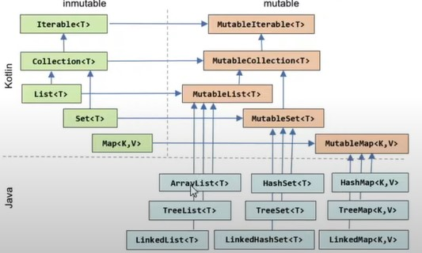

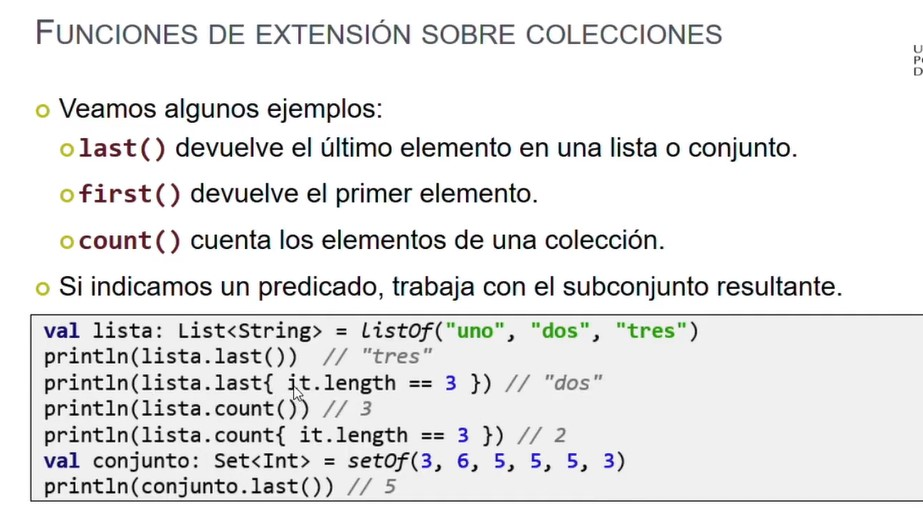

#### Arrays 
En Kotlin, un array es una estructura de datos que almacena una colección de elementos del mismo tipo. Los arrays se definen utilizando la clase Array, que proporciona métodos para acceder y manipular sus elementos y empiezan desde la posicion 0 

```kotlin 
val numeros = arrayOf(1, 2, 3)

```

También se puede modificar un elemento de un array utilizando el operador []:
```kotlin
numeros[0] = 4

```
### Listas
Una lista (List) es una colección ordenada de elementos que se pueden acceder mediante su posición en la lista. En Kotlin, las listas se definen utilizando la interfaz List, que tiene varias implementaciones, como ArrayList, LinkedList y mutableListOf.

```kotlin
val numeros = listOf(1, 2, 3)
```
Las listas son inmutables por defecto, lo que significa que no se pueden modificar después de crearlas. Si se necesita una lista mutable, se debe utilizar mutableListOf en lugar de listOf.

#### Set 
Un conjunto (Set) es una colección de elementos que no se pueden repetir y no tienen un orden específico. En Kotlin, los conjuntos se definen utilizando la interfaz Set, que tiene varias implementaciones, como HashSet y mutableSetOf.

```kotlin
val numeros = setOf(1, 2, 3)
```
Los conjuntos también son inmutables por defecto, pero se pueden crear conjuntos mutables utilizando mutableSetOf.

#### Maps
Un mapa (Map) es una colección de pares clave-valor. En Kotlin, los mapas se definen utilizando la interfaz Map, que tiene varias implementaciones, como HashMap y mutableMapOf.

```kotlin
val edades = mapOf("Juan" to 25, "Maria" to 30, "Pedro" to 20)
```
Para acceder a un valor en el mapa, se utiliza la clave correspondiente
```kotlin
val edadJuan = edades["Juan"]
```

#### .Filter
El “.filter” nos permite filtrar en la lista a través de una o varias condiciones que
pongamos. Para ello llamamos a “it” (iterator) y buscaremos en la lista, si contiene la
palabra “Lunes” o “Juernes“.

```kotlin
val a = readOnly.filter { it == &quot;Lunes&quot; || it == &quot;Juernes&quot; }
```

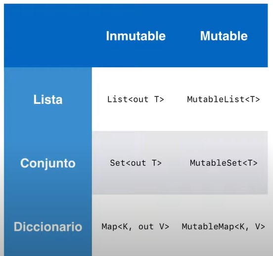


#### Funciones 
Una función no es más que un conjunto de instrucciones que
realizan una determinada tarea y la podemos invocar mediante su nombre.
```kotlin
fun main() {
	greeting()
    
}

fun greeting(){

    println("Hola")
}
```

#### Funciones con parámetros de entrada

las funciones con parámetros de entrada, que son iguales, pero al
llamarlas habrá que mandarle las variables que necesite.
```kotlin
fun main() {
	greeting("Enrique",5)
    
}

fun greetin(name:String, age:Int){
    println("hola $name y edad $age")
}
```

#### Funciones con parámetros de salida
Una función puede devolver un resultado o lo que haga nuestro
método. La única limitación es que solo se puede devolver un parámetro.

```kotlin
fun main() {
	var result =  sumar(5,10)
    println(result)
}
  
fun sumar(number1:Int, number2:Int):Int{
 return number1.plus(number2)

}
```
Como el ejemplo anterior añadimos los parámetros de entrada, pero esta vez, al cerrar los
paréntesis pondremos el tipo de variable que debe devolver nuestra función. Luego la
función hará todo lo que tenga que hacer y cuando tenga el resultado, lo devolveremos
con la palabra clave “return”.

#### Parametros y argumentos 

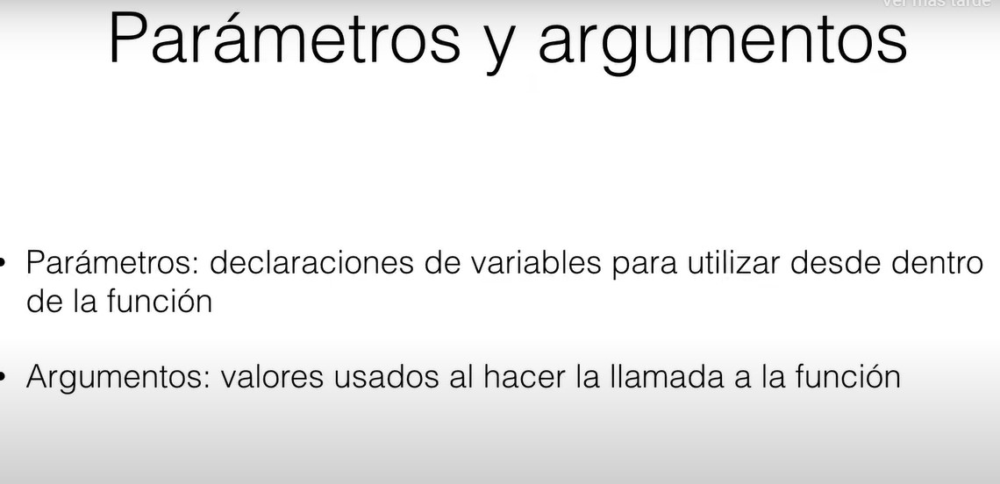

#### Programacion orientada a objetos (POO)

Es un paradigma de programacion orientada en la abstraccion de objetos de la vida real a la programacion. Para crear un objeto primero tenemos que entender como funcionan las clases 

#### Diagrama de clases UML 

Una clase es una plantilla o un molde que define la estructura y el comportamiento de un objeto. Esta cuenta con un nombre, atributos y un metodos: 

El nombre es como llamaremos a nuestra clase, un atributo representa las caracteristicas de la clase y los metodos el funcionamiento que va a tener dicha clase. Estas clases pueden se publicas,privadas, protegida o por su paquete y a esto se le denomina visibilidad.

Al referirnos que es publica, significa que cualquier otra clase puede acceder a ella, cuando es privada ninguna clase o subclase pueden acceder a ella, cuando es protegida solo la misma clase o subclase puede acceder a ella.


### Visibilidad en clases 
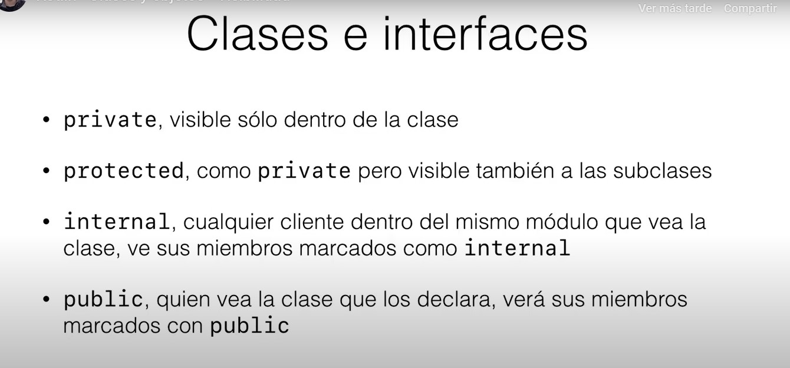

### Visibilidad en general 


#### Relaciones entre clases 

1. Herencia: es un mecanismo que permite definir una nueva clase a partir de una clase existente. La nueva clase hereda todos los atributos y métodos de la clase existente, lo que significa que puede utilizarlos y agregar nuevos elementos a ellos sin tener que escribir todo el código desde cero.

La clase existente se llama clase padre o superclase, y la nueva clase se llama clase hija o subclase. La relación entre las dos clases se denomina relación de herencia.

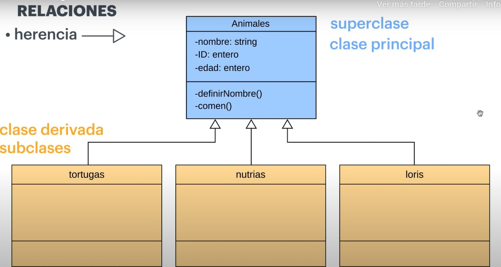

2. Asociación: es la relación más básica entre dos clases, en la que una clase tiene una referencia a otra clase. Por ejemplo, una clase "Estudiante" puede estar asociada con una clase "Universidad" porque un estudiante asiste a una universidad.

3. Agregación: es una relación en la que una clase contiene una colección de otras clases, pero las clases contenidas pueden existir sin la clase que las contiene. Por ejemplo, una clase "Universidad" puede tener una colección de clases "Facultad", pero estas clases también pueden existir fuera de la universidad.

4. Composición: es una relación en la que una clase contiene una colección de otras clases y estas clases contenidas no pueden existir sin la clase que las contiene. Por ejemplo, una clase "Coche" puede tener una clase "Motor" que no puede existir sin el coche.

5. Implementación: es una relación en la que una clase implementa una interfaz. Una interfaz es una especificación de un conjunto de métodos que una clase debe implementar. Por ejemplo, una clase "Círculo" puede implementar la interfaz "Figura" que especifica los métodos "calcular área" y "calcular perímetro".


#### Creacion de clases en kotlin

Para crear un clase en kotlin utilizamos la palabra reservada class:

```kotlin
class Invoice(){

}
```

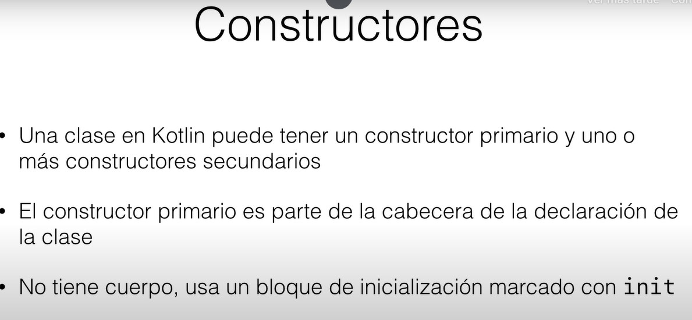


Tambien podemos almacenar los parametros en una variables desd el constructor

```kotlin
class Person(val firstName:String, val lastName:String){
    
}
```

#### Ejemplo de un a clase con constructor
```kotlin 
fun main(){
    var ferrari : Automovil = Automovil("Ferrari","Verde",5000)

    ferrari.endender()
}


class Automovil (val marca:String,
                 val color: String,
                 val precio: Int,){
    fun endender (){
        println("Ha encendido el $marca")
    }

    fun acelerar(){
        println("Ha acelerado")
    }

    fun detener(){
        println("Se ha detenido")
    }
}
```

#### Tipos de clases

1. Abierta y cerrada: En kotlin las clases por defecto siempre van a ser cerradas incluyendo sus propiedades y metodos, no se puede utilizar la herencia en este tipo de clases. La abierta si se puede heredar y se utliza la palabra reservada **open**

```kotlin 
open class Padre(p: Int)

class hijo(p:Int): Padre(p)
```

2. Abstracta: no puede se instanciada por que nos falta informacion para crear un objeto con esa clase. Este tipo de clase se utiliza principalmente como platilla para extender otras clases(__NO LO HE ENTENDIDO BIEN__)

3. Anidadas e internas: En kotlin se puede declarar clases dentro de otras clases dando lugar a una clase anidada y para poder declarar una clase anidada se utliza la palabra reservada **inner**

```kotlin 

class Externa{
    private val number = 1 
    inner class Interna{

        fun funcion()= propiedad 
    }
}
```

#### Modulos 

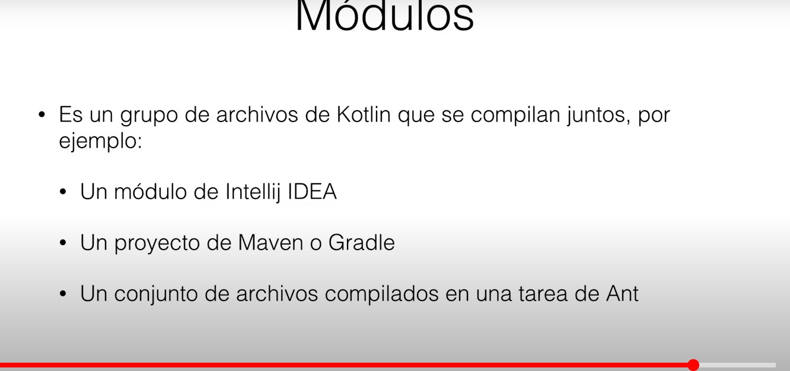

#### Los gets y sets 

La palabra clave get se utiliza para definir el comportamiento de lectura de una propiedad, mientras que la palabra clave set se utiliza para definir el comportamiento de escritura de una propiedad. Ejemplo: 

```kotlin 
class Persona {
   var nombre: String = ""
       get() = field.capitalize()
       set(value) {
           field = value.trim()
       }
}
```

En este ejemplo, la propiedad nombre es una cadena de texto (String). El bloque get() devuelve la propiedad nombre en mayúsculas utilizando la función capitalize(), mientras que el bloque set(value) establece la propiedad nombre eliminando cualquier espacio en blanco utilizando la función trim().

Es importante mencionar que el modificador field es utilizado para hacer referencia al valor actual de la propiedad, de esta forma se puede acceder al valor anterior antes de que se realice una asignación.


Estos metodos estan relacionados con el encapsulamiento. Que es el encapsulamiento?

###### Encapsulamiento 
El encapsulamiento se refiere a la capacidad de una clase para ocultar la complejidad interna de su implementación y proporcionar una interfaz pública clara y sencilla para que los objetos externos interactúen con ella.
 
###### En que se relaciona el encapsulamiento con los set y get?
Los métodos set y get están relacionados con el principio de encapsulamiento, ya que son una forma de controlar el acceso a los campos de datos de una clase.

#### Data Class 
Es una clase especial que se utiliza principalmente para representar datos. Una data class se utiliza para almacenar datos de manera estructurada, lo que facilita su manipulación y procesamiento en el código.

Una data class tiene varias características especiales en Kotlin. Cuando se define una data class, el compilador de Kotlin automáticamente genera una serie de métodos estándar, como equals(), hashCode(), toString(), componentN(), etc., lo que hace que el código sea más fácil de leer y mantener.

1. equals(): compara dos objetos de la clase por sus propiedades.
2. hashCode(): devuelve un valor hash único para el objeto de la clase.
3. toString(): devuelve una representación en forma de cadena del objeto de la clase.
4. componentN(): devuelve las propiedades de la clase en forma de pares clave-valor.

Ejemplo:

```kotlin 
data class SuperHeroe(
    nombre:String,
    editorial: String,
    nombreReal:String  
)

fun main(){
    val batman: SuperHeroe = SuperHeroe("Batman","DC","Bruno Diaz")

    println(batman.toString())
}

```

#### Enum class

una enum class en Kotlin es una clase especial que se utiliza para representar un conjunto de valores constantes con nombre. Es una forma de definir un conjunto de opciones que se pueden elegir en un programa, como los días de la semana, el tipo de moneda, el género, etc.

Las enum class son útiles porque permiten que el código sea más fácil de leer y entender, ya que cada valor constante tiene un nombre significativo. También son más seguras en términos de tipos, ya que el compilador puede comprobar que se está utilizando el valor correcto en cada contexto.

Además, las enum class pueden tener propiedades, métodos y constructores personalizados, lo que permite agregar más funcionalidades a los valores de la enum class.

Tambien las enum class tiene proiedades y funciones  por defecto:

1. .Name:Esta función devuelve una representación de cadena de texto del valor constante de la enum class.

2. valueOf: Esta función se utiliza para obtener un valor constante de la enum class a partir de su nombre. Por ejemplo, si tenemos una enum class llamada DiaDeLaSemana que contiene el valor constante LUNES, podemos obtener ese valor utilizando la función DiaDeLaSemana.valueOf("LUNES").

3. values: Esta función devuelve una matriz de todos los valores constantes de la enum class en el orden en que se han definido.

4. ordinal: Esta propiedad devuelve la posición del valor constante en la lista de valores de la enum class como un número entero.

```kotlin 
enum class DiasDeLaSemana{

    Lunes,Marte,Miercoles,Jueve,Viernes,Sabado,Domingo
}
```

#### Objetos nombrados 

Un objeto nombrado es una instancia de una clase que se crea de manera única y se nombra en el momento de su definición. A diferencia de las clases regulares, los objetos nombrados no pueden ser instanciados directamente mediante la palabra clave new, y solo hay una única instancia de un objeto nombrado en todo el programa.

Los objetos nombrados se utilizan comúnmente para crear instancias de clases que solo necesitan una sola instancia en todo el programa, como una clase para almacenar configuraciones o un proveedor de servicios. También se utilizan para crear funciones de utilidad que no necesitan un estado y que se pueden invocar en cualquier lugar del programa.

```kotlin 
object Calculadora {
    fun sumar(a: Int, b: Int): Int {
        return a + b
    }

    fun restar(a: Int, b: Int): Int {
        return a - b
    }
}

fun main() {
    val resultadoSuma = Calculadora.sumar(5, 3)
    println("Resultado de la suma: $resultadoSuma")

    val resultadoResta = Calculadora.restar(10, 4)
    println("Resultado de la resta: $resultadoResta")
}
```

En este ejemplo, se crea un objeto nombrado llamado Calculadora que tiene dos funciones de utilidad: sumar y restar. Luego, en la función main(), se invocan estas funciones para realizar una suma y una resta.