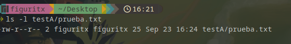
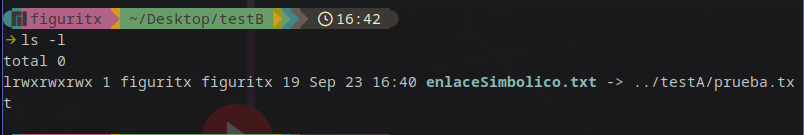
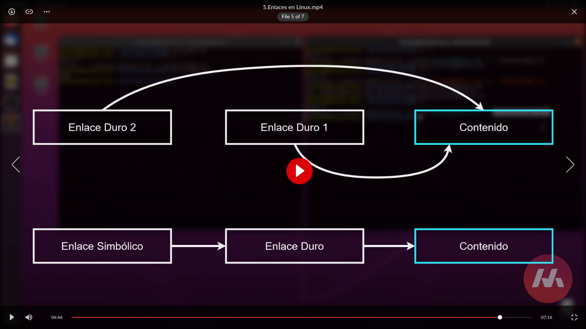
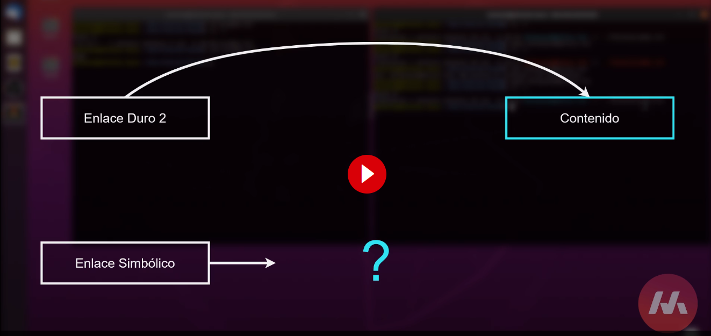

# Comandos en linux

Estos no son comandos, son programas que hacen algo como listar, elimar, moverse entre directorios,etc. TU PUEDES CREAR TUS PROPIOS COMANDOS

- rm -r: elimina un directorio con cosas adentro
- rm -ri: te pregunta si quieres eliminar el directorio, por qu -r elimina todo para siempre
- man [comando] : te dice que argumento puedes utlizar con ese comando
- ./: te dice el directorio anterior
- ls -l : te da informacion listada de los directorios, como que tipo es, el nombre, los permisos, bits que ocupa, etc
- grep "PalabraABuscar" {NombreFichero} :para buscar algo en concreto en un fichero
- sudo nano /etc/default/grup: en este directorio puedes cambiar como se inicia el grup y cambiando el tiempo que te da para escoger el sistema
- sudo update-grub: actualiza el grub

### Comandos para arch(**NO USAR EN DISTROS QUE NO SEAN ARCH**)

- pacman -Qqm: lista los paquetes intalados con AUR
- pacman -Q: lista los paquetes instalados en el sistema con pacman
- pacman -Qe: lista los paquetes instalados en el sistema con pacman y los que no son de pacman
- pacman -Rsn {nombre del paquete}: elimina el paquete y sus dependencias

### Comando rar

- rar a {nombre de la carpeta.rar} {nombre de la carpeta}: comprime una carpeta en rar, ejemplo:

```bash
rar a carpeta.rar carpeta/
```

- find [carpeta]/ -name [nombre del archivo]: busca un archivo en una carpeta

```bash
find test/ -name "test*"
```

- cp -r {nombreCarpeta}: copia una carpeta

- grep ^? {nombre del archivo}: busqueda en un archivo con expresiones regulares

```bash
grep ^t  test.txt
```

- cut: corta una parte de un archivo de texto y en el la fila puede tener rangos,por ejemplo:

```bash
cut -d " " -f 3 test.txt (-d) es el delimitador y (-f) es la fila que quieres cortar
cut -d " " -f 3,5 test.txt : corta la fila 3 y 5
cut -d " " -f 3-9 test.txt : corta la fila 3 a la 9
```

- sed(Stream Editor): es una herramienta de línea de comandos en Linux y otros sistemas tipo Unix que se utiliza para realizar transformaciones de texto en archivos o flujos de dato. Puede usarse para buscar, reemplazar, eliminar o manipular texto en archivos de manera eficiente. Aquí hay una descripción general de cómo usar sed y algunos ejemplos comunes:

```bash

sed 's/{texto a reemplazar}/{texto nuevo}/g' {nombre del archivo} (-g) es para que reemplace todas las coincidencias

```

Normalmente el donde dice texto a remplazar se usa una expresion regular.

- Tail : muestra las ultimas lineas de un archivo, por ejemplo:

```bash

tail -n 5 {nombre del archivo} : muestra las ultimas 5 lineas del archivo

tail -n +2 {nombre del archivo} : muestra las lineas del archivo desde la 2 hasta el final

```

- Head : muestra las primeras lineas de un archivo, por ejemplo:

```bash

head -n 5 {nombre del archivo} : muestra las primeras 5 lineas del archivo

head -n +2 {nombre del archivo} : muestra las lineas del archivo desde la 2 hasta el final

```

---

### Permisos

- r: lectura
- w: escritura
- x: ejecucion
- chmod u+(persmiso) (nombre del archivo): cambia los permisos de un archivo, u es para el usuario y tambien la g es para gurpo y la o para otros

- chmod u-(persmiso) (nombre del archivo): el menos elimana el permiso

Tambien puedes usar numeros para los permisos de la siguiente forma:

Aqui tiene una lista de algunos valores num�ricos y de los significados relativos:

- -rw------- (600) — S�lo el usuario tiene el derecho de leer y escribir.

- -rw-r--r-- (644) — S�lo el usuario tiene los permisos de leer y escribir; el grupo y los dem�s s�lo pueden leer.

- -rwx------ (700) — S�lo el usuario tiene los derechos de leer, escribir y ejecutar el fichero.

- -rwxr-xr-x (755) — El usuario tiene los derechos de leer, escribir y ejecutar; el grupo y los dem�s s�lo pueden leer y ejecutar.

- -rwx--x--x (711) — El usuario tiene los derechos de lectura, escritura y ejecuci�n; el grupo y los dem�s s�lo pueden ejecutar.

- -rw-rw-rw- (666) — Todo el mundo puede leer y escribir en el fichero. �No es una buena elecci�n!

- -rwxrwxrwx (777) — Todo el mundo puede leer, escribir y ejecutar. �Otra mala elecci�n!

---

### Enlaces duros

#### **NOTA IMPORTANTE NO SE PUEDEN HACER ENALCES DUROS EN DIRECTORIOS**

Un enlace duro es que puedes tener varios nombres de archivo que apuntan a los mismos datos en el disco duro, sin duplicar esos datos. Esto puede ahorrar espacio en disco y te permite acceder a los mismos contenidos desde diferentes ubicaciones en tu computadora.

</img>

Cuando haces un ls -l te muestra cuantos enlaces duros tienes en el archivo, si tienes 2 enlaces duros y eliminas uno, el archivo no se elimina hasta que elimines el otro enlace duro.

Para crear un enlace duro se usa el comando ln, el cual tiene la siguiente sintaxis:

```bash
ln {archivo} {nombre del enlace duro}
```

---

### Enlace simbolico

Un enlace simbolico es un archivo que apunta a otro archivo, pero no contiene los datos del archivo al que apunta, sino que contiene una referencia a otro archivo. En otras palabras, un enlace simb�lico es como un acceso directo de Windows. Un enlace simb�lico puede apuntar a un archivo o directorio en cualquier lugar del sistema o en cualquier otro sistema en red.

</img>

Para crear un enlace simbolico se usa el comando ln, el cual tiene la siguiente sintaxis:

```bash
ln -s {archivo} {nombre del enlace simbolico}
```

</img>

</img>

---

### Directorios importantes

- /: directorio raiz y es de donde cuelga todo el sistema
- /bin: contiene los binarios de los programas que se pueden ejecutar por cualquier usuario
- /boot: contiene los archivos necesarios para el arranque del sistema
- /dev: contiene los archivos de dispositivos, osea el harware(discos duros,etc) que estan conectados a la computadora
- /etc: contiene los archivos de configuracion del sistema
- /home: contiene los directorios de los usuarios
- /lib: contiene las librerias del sistema
- /lost+found: es donde estan los archivos corruptos
- /media: es donde se montan los dispositivos externos
- /mnt: es donde se montan temporalmente sistemas de ficheros
- /opt: es donde se instalan los programas que no son open source, osea son programas propietarios
- /proc: contiene informacion sobre los procesos del sistema
- /root: es el directorio del usuario root
- /run : contiene archivos de ejecucion de programas
- /sbin: contiene los binarios de los programas que solo puede ejecutar el usuario root
- /srv: contiene los archivos de datos de los servicios que ofrece el sistema
- /sys: contiene informacion sobre el sistema y hardware
- /tmp: contiene archivos temporales
- /usr: contiene los programas y archivos que usan los usuarios
- /var: contiene archivos variables como logs, bases de datos, etc

---

### Expresiones regulares

Las expresiones regulares (regex o regexp) son patrones de búsqueda que se utilizan para buscar y manipular texto basado en ciertos criterios.

\*-Cero o más caracteres, ejemplos:

todos los archivos: _
todos los archivos html: _.html
todos los archivos que empiezan por f: f\*

```bash
rm  *.txt: elimina todos los archivos que terminen en .txt

rm a*.txt: elimina todos los archivos que empiecen con a y terminen en .txt

```

? Un único carácter cualquiera, ejemplos:

todos los archivos txt con un solo carácter: ?.txt
todos los txt que empiezan por 'a' seguidos de un carácter: a?.txt

```bash
rm *-?.txt: elimina todos los archivos que terminen en - y tengan un caracter antes de .txt

```

[ ] Cumple la expresión si contiene uno de los caracteres incluidos, ejemplos (Es como si fuera un if, donde la condicion es que sea == a algo):

Algunos ejemplos:

Los archivos fA.txt, fB.txt y fC.txt: f[ABC].txt
Para invertir la expresión se usa " ^ ", por ejemplo:

Ficheros txt de nombre f que no acaban en A, B o C: f[^ABC].txt
Para especificar rangos, se usa " - ":

Ficheros txt de nombre f que acaban en un dígito: f[0-9].txt
Ficheros txt de nombre f que acaban en dos dígito: f[0-9][0-9].txt
Ficheros txt de nombre f que acaban en una mayúscula: f[A-Z].txt
Los que acaban en una minúscula o mayúscula: f[a-zA-Z].txt

1. [abc] coincidirá con cualquier carácter que sea "a", "b" o "c".

2. [0-9] coincidirá con cualquier dígito del 0 al 9.

3. [A-Za-z] coincidirá con cualquier letra mayúscula o minúscula.

4. [aeiou] coincidirá con cualquier vocal minúscula

```bash
rm fichero[AB].txt: elimina los archivos que terminen en A o B

rm fichero[^AB].txt: elimina los archivos que no terminen en A o B

rm f-[1-7] : elimina los archivos que empiecen con f- y terminen con un numero del 1 al 7
```

{ } Igual que el anterior, pero para más caracteres en lugar de uno solo:

    Archivos fAB.txt y fDC.txt: f{AB,DC}.txt

```bash

rm f{AB,AC,AD}.txt: elimina los archivos fAB.txt, fAC.txt, y fAD.txt en el directorio actual

```

---

### Permisos en directorios

- r: lectura
- w: escritura
- x: ejecucion

### Redirecciones en linux

En Linux, las redirecciones son un mecanismo importante para controlar la entrada y salida de datos de los programas y comandos en la línea de comandos. Pueden ser utilizadas para redirigir la salida estándar (stdout), la salida de error estándar (stderr) y la entrada estándar (stdin) de un comando o programa.

- stdin: standard input 0, el proceso del teclado tiene el input

  - <: Este operador redirige la entrada estándar de un comando desde un archivo. Por ejemplo, mi_programa < entrada.txt tomará la entrada del archivo "entrada.txt" en lugar de esperar la entrada del teclado.

- stdout: standard output 1, por ejemplo los procesos de la pantalla tiene el output

      * >: Este operador redirige la salida estándar de un comando hacia un archivo. Por ejemplo, ls > lista_archivos.txt redirigirá la lista de archivos generada por el comando "ls" al archivo "lista_archivos.txt", sobrescribiendo el archivo si ya existe.

      * > > : Similar a >, pero agrega la salida al final del archivo en lugar de sobrescribirlo. Por ejemplo, ls >> lista_archivos.txt agregará la lista de archivos al final del archivo existente "lista_archivos.txt".

- stderr: standard error 2 , por ejemplo los procesos de error tiene la pantalla

  - 2> : Este operador redirige la salida estándar de un comando hacia un archivo. Por ejemplo, ls > lista_archivos.txt redirigirá la lista de archivos generada por el comando "ls" al archivo "lista_archivos.txt", sobrescribiendo el archivo si ya existe.

  - 2>> : Similar a >, pero agrega la salida al final del archivo en lugar de sobrescribirlo. Por ejemplo, ls >> lista_archivos.txt agregará la lista de archivos al final del archivo existente "lista_archivos.txt".

```bash
python3 error.py 2> error.txt > salida.txt < entrada.txt : redirige el error a error.txt y la salida a salida.txt y la entrada a entrada.txt

```

### Pipes en linux

Los pipes (tuberías) son un mecanismo poderoso en sistemas Unix y Linux que permite combinar la salida de un comando con la entrada de otro comando de manera secuencial. Esto facilita el procesamiento y la manipulación de datos en la línea de comandos. El operador de tubería en Linux es el símbolo |.

Las pipes es un forma de comunicar procesos que se cominican entre si

```bash
ls -l | grep Documents : busca en la salida de ls -l la palabra Documents

ls -l | tail -n +2 | sed "s/  */ /g" | cut -d " " -f 9 : Te va a listar las carpetas que haya en algun directorio

```

---

### Donde se guardan los usuarios?

Se guardan en el archivo /etc/passwd y se guardan diferentes usuarios como el root, el usuario de la computadora, etc.

Tamien se guardan en el archivo /etc/shadow, pero este archivo solo lo puede ver el usuario root.

Hay otra ruta donde podemos ver cuales usuarios puede usar el comando sudo y es en el archivo

/etc/sudoers

Tambien podemos ver los grupos que hay en el archivo /etc/group

---

### Daemons o servicios

Los daemons son procesos que se ejecutan en segundo plano y que no estan asociados a ningun usuario, por ejemplo el servicio de apache, el servicio de mysql, etc.

Para ver los servicios que estan corriendo en el sistema se usa el comando systemctl

```bash
systemctl : muestra todos los servicios que estan corriendo en el sistema

systemctl status {nombre del servicio} : muestra el estado del servicio

systemctl start {nombre del servicio} : inicia el servicio

systemctl stop {nombre del servicio} : detiene el servicio y lo tienes que iniciar manualmente

systemctl enable {nombre del servicio} : habilita el servicio para que se inicie automaticamente cuando enciendes el pc

systemctl disable {nombre del servicio} : Detiene el servicio hasta que lo prendas manualmente
```

### Bash scripting

Los scripts de bash son archivos de texto plano que contienen una serie de comandos que se ejecutan paso a paso. Los scripts de bash se pueden ejecutar en un terminal de Linux o Mac o en un símbolo del sistema de Windows.

Para crear un script de bash se usa el comando nano, el cual tiene la siguiente sintaxis:

```bash

nano {nombre del archivo}.sh

```

Para ejecutar un script de bash se usa el comando bash, el cual tiene la siguiente sintaxis:

```bash

bash {nombre del archivo}.sh

```

Para ejecutar un script de bash de forma glabal, necesitamos declarar a inicio del archivo el interprete de bash, el cual tiene la siguiente sintaxis:

```bash

#!/bin/bash
echo "Hola"
```

Despues de eso le damos permisos de ejecucion al archivo con el comando chmod, el cual tiene la siguiente sintaxis:

```bash

chmod +x {nombre del archivo}.sh

```

Y por ultimo lo ejecutamos con el comando ./, el cual tiene la siguiente sintaxis:

```bash
./{nombre del archivo}.sh

```
